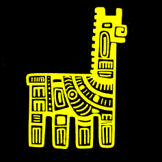
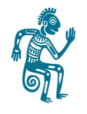
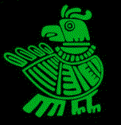
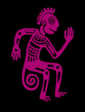
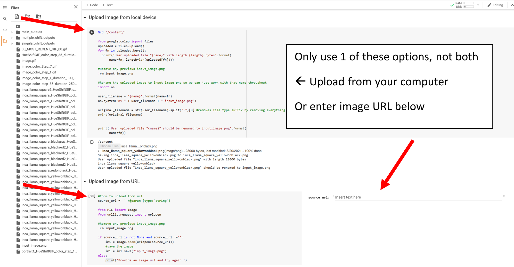
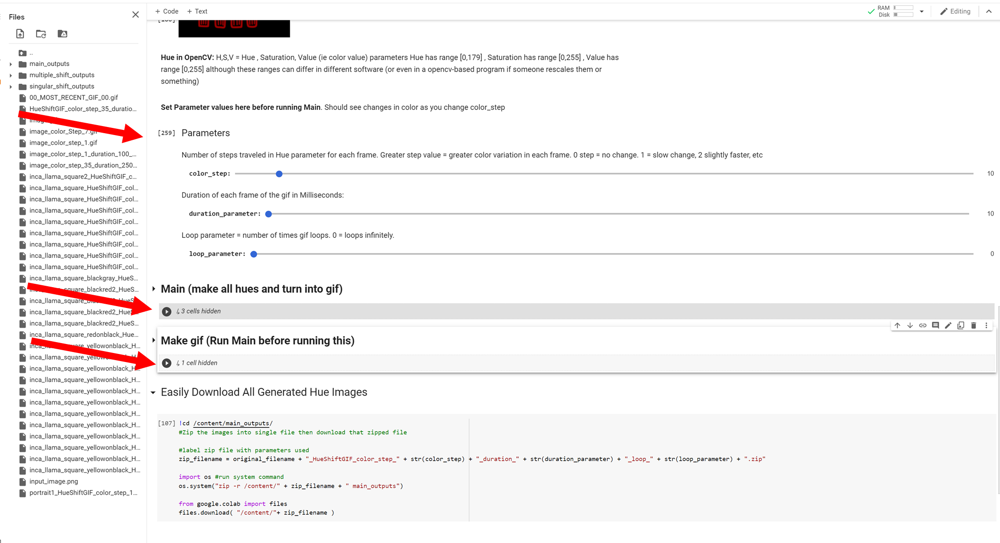

# OpenCV_Rave
Make Color Changing GIFs in OpenCV! 

## How To Use 
Just Open the Notebook **changeHueOpenCV.ipynb** in Google Colab by clicking the **Open in Colab** button above. Here it is again:  You should know how to run basic notebook. If you don't, well just click the play buttons pointed to in the screenshots below. 

Once open in colab simply upload your image. I made 2 methods: from local device and from URL. Choose one (only one! if you do both the last method will overwrite the other). Pretty simple: 

Once uploaded you simply have to run the 'Parameters' cell (the one with sliders). Made parameters selectable as sliders for ease. Then simply run the 'Main' and 'Make GIF' sections. 

Your gif should now be on the left hand side (might take a few seconds to show there). If you do not see the files after 30 seconds then close and reopen the files section or  rerun. If you do not see the files section it opened with the folder icon on the left. I It will be labeled according to the parameters used. You can download all the hue variation (ie all the images used to make the gif) by running the cell labeled easily download, will download as a zip file. 

### Parameters 

**color_step** = parameter related to number of different hues/colors used. If this is =0 you only only get 1 image/hue, the original. If its =1 you get 180 hues, the max amount. If =2 you get 90. If=3 you get 60. So on to =90 where you get 2 hues. **NOTE** that although this is 2 hues you'll get a different hue for every selection. So at 90 it might flash between original color and blue but at 150 it might flash between the original and red.

**duration_parameter** = how long each frame of the gif shows in milliseconds.

**loop_parameter** = how many times the gif loops. If this =0 it will loop infinitely 

### Variables Changed
Change solely Hue vector which has bounds [0,179]. Extension might be to chage both saturation and (color) value vectors as well. Those both have bounds of [0,255] (basically the familiar RGB bounds except in OpenCV we mostly work in a BGR based vector space. 

### Technical Notes
Observe the list **my_hue_list**. This determines the pattern. So if you want a new pattern or even a manual pattern you can play with this list. Can theoretically be however long you want but try to keep the values to whole numbers between (and including) 0 and 179. Can actually go outside this bound if needed (ie generate some unique pattern) because we apply a modulo_180 function later in the script, but if doing manually it might just add confusion to go outside these bounds (ie you'll have to do modulo_180 in your head to know what the hue is). 

**Transparency in png's** 

Alpha channels are basically the degree of transparency in a png. Only applicable to png's so we comment them out here. Alpha channel tends to be most frequent problem if present. 

If you want to preserve transparent parts please uncomment all the alpha channel parts and related variables, NOTABLY bgra. And in the final line of the for loop: cv2.imwrite(output_filename, bgr_new), change bgr_new to this bgra variable.

(also cant even have it as a capital .PNG, has to be lowercase)

### Reference Code
Some code both from me and the referenced links used to make the program. Use these if you just want to change the hue and do nothing else. Although setting the color_step parameter to 1 gives you all possible hues anyway, so really only do to get in-depth. (Also still has alpha channel code uncommented so can use it to get single transparent variations by selecting for bgra) 

